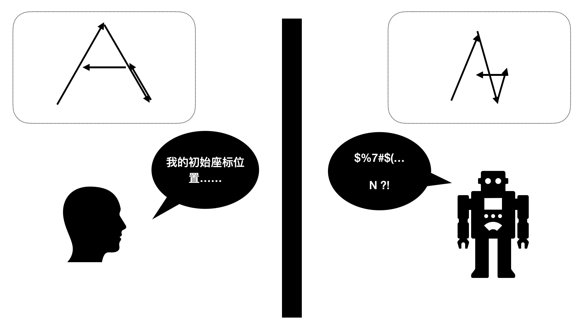

---
date:
  created: 2025-03-19
categories:
    - Philosophy
    - Life
    - Tech
comments: true
---

# 别慌，人工智能还考不进师大二附中

## 人工智能的安全焦虑与现实
我中学母校是师大二附中。在ChatGPT刚开始火爆的那一阵，老师邀请我回去给学弟学妹讲人工智能。当时正值《减轻人工智能带来的人类灭绝风险》公开信发布之际，媒体正在疯狂炒作“人工智能”的安全问题，而同学们最关心的问题大多也围绕这个点：

- “人工智能时代，社会真的只需要精英吗？”
- “人工智能完成的论文是否具有学术价值？”
- “人工智能是否有可能或者已经通过‘图灵测试’？”
- ……

从这些问题可以看出大家仿佛担忧《终结者》中的天网时代就要开启，人类与机器的大战即将到来。我笑道：“别慌，你们都是目标清华北大的尖子生，人工智能现在的实际能力还远达不到你们小学到初中升学考试的水平，它截至目前的最大进步是说出的话比以前语法更流畅，不那么答非所问甚至狗屁不通。”我不是瞎说，因为它的实际认知能力不如幼儿园，推理不如小学生。

## 逻辑不如小学生
师大二附中当年是国有民办学校，所以有完全自主招生权，因此想入学必须经过一个能力测试。别的试题我都记不清了，唯独一道分值很高的推理题的题型让我印象深刻——多条件逻辑推理。它广为流传的一个复杂版本是“爱因斯坦谜题”，总共有5个变量和15个条件。下面是一个3个变量和4个条件版本的谜题：

> 新学期开始了,班里换了新的老师,她们是林老师、王老师和吴老师。三位老师分别教语文、数学、英语课。已知：
（1）每个老师只教一门课；
（2）林老师上课全用汉语；
（3）英语老师是一个学生的哥哥；
（4）吴老师是一位女教师，她比数学老师活泼。
问：三位老师各上什么课？

就是这么一道大多数人通过画表格就能轻松解决的小学推理题能够难住当下所有流行的大语言模型，没有例外。这暴露了它们的共同的局限性——不具备小学水平的逻辑思考能力。尽管“思维链技术”展现的“思维过程”让他们看上去像是在推理，实际上只是在说语法通顺而逻辑混乱的胡话。招生老师看到这样的试卷的结论一定是“不懂装懂、瞎糊弄，给0分”，因而录取的结果自然不会很好。

## 误解的来源——鸭子测试
“人工智能危机”是一个很时髦的话题，我当然不是否认近几年大语言模型为代表的人工智能技术取得了长足的进步，但是现在媒体尤其是自媒体的渲染有点过了头——里面甚至掺杂了不少由于缺乏了解造成的想象。这种误解来源于人们认知中的一个常见假设：“如果它看起来像鸭子、游泳像鸭子、叫声像鸭子，那么它可能就是只鸭子”——这也是谈笑风生的美国记者华莱士提到过的“鸭子测试”。

然而，“可能是鸭子”的鸭子未必是真鸭子，因为这取决于测试的方式和比较的维度——能在100米外通过“鸭子测试”的仿真玩具100元人民币能买好多只，只是用来煮汤的时候真假鸭子的差距可就显而易见了。现在的新闻标题里不难看到“X模型在Y任务中超过了Z”之类的惊悚标题，仿佛计算机已经学会了如人类一样思考，律师、医生、程序员等一系列专业人士立马就要失业。实际上，这种测试很容易陷入类似于拿计算器跟数学教授比速算的片面比较，从而得出前者数学水平高过后者的荒谬结论。

## 智能的标准——图灵测试

那什么样的评价标准能够比较全面地评判人工智能的水准呢？很遗憾，在搞清楚智能是怎么产生并且给它准确定义之前，很难有一个公认的标准，不过者并不妨碍人们尝试去定义它：“图灵测试”便是其中最负盛名者。

图灵测试其实和鸭子测试有点相似，可以概括为：如果计算机能像人一样交流，那么它可能具备了人一样的智能。换句话说，如果一个机器能够伪装成人与人类进行足够长时间的沟通而不被发觉，那么这个机器就通过了测试。

然而图灵测试虽然具有可操作性，其描述却比较模糊，实际的效果千差万别，因为不同的测试者的能力会有显著的差异。比如前一段时间“真假靳东”诈骗中老年妇女的新闻就闹得沸沸扬扬——这种对大多数人看一眼就知道是人工智能生成的假的视频缺依然蒙住了很多人。实际上，某些最新的论文研究表明GPT-4的图灵测试通过率已经达到了54%，这是一个乍一看非常惊人的数字。实际上，对于了解人工智能原理的测试者，当前最先进的模型的通过图灵测试的概率可以说无限接近于0。

从本质上说，我们比较两个事物是否“相同”靠的是它们是否存在某些关键性的“不同”。图灵测试就是通过给被测试者一个语言的输入，观察它的输出，然后判断这个输出是否与“常人”保持一致。因此，一种有效的测试方式是测试者用语言为测试对象描绘一个基于自己认知和广泛共识的“虚拟世界”并一同在这个世界中进行“探索”。最后测试者根据测试对象在探索结果的描述中找与自己想法不一样的地方——这些异同往往就是区分智能与非智能的强烈信号。

例如，我们可以假想自己在一个二维平面上，用轨迹画一个字母A：

> 我的初始座标位置(100, 100), 现在依次走到 (102, 104), (104, 100), (103, 102), (101, 102)，我走出来的轨迹是个什么字母？

显然，对于这样难度的问题，哪怕是喝了酒的醉汉也说不出ChatGPT这样的胡话：

> 画出这条轨迹，我们发现它形似英文字母 "N"：
> - 先上升到高点（第一步），
> - 再斜向下降到底部（第二步），
> - 然后中间折回（第三步），
> - 最后走到左侧（第四步）。
>
> 所以，你走出的轨迹像字母 "N"！

## 智能的假象——鹦鹉学舌

然而，“图灵测试”也不乏质疑之声，其中最著名的莫过于“中文房间”思想实验：

> 一个对中文一窍不通，只说英语的人关在一间只有一个开口的封闭房间中。房间里有一本用英文写成的手册，指示该如何处理收到的中文讯息及如何以中文相应地回复。房外的人不断向房间内递进用中文写成的问题。房内的人便按照手册的说明，寻找合适的指示，将相应的中文字符组合成对问题的解答，并将答案递出房间。尽管房里的人可以以假乱真，让房外的人以为他说中文，但事实上他根本不懂中文。

这个思想实验有一个更地道的中文表述：“学舌的鹦鹉不会讲话。”只不过大语言模型比鹦鹉“学”得更多罢了。

那么凭什么证明当下的人工智能不过是学舌呢？如下两个测试可以说明这一点：

这两个问题交给当下流行的大语言模型，结论一律都是“一样大”、“一样长”，当你质疑的时候还会说：“不信你拿尺子量一量”。可见，大语言模型的认知水平和鹦鹉没有本质区别，远不如幼儿园的小朋友。

那为什么会出现这种情况呢？原因在于大语言模型的原理——它可以近似理解为通过分析大量的文本得到的统计数据，根据对话的上下文去推测蹦出下一个词的可能选项以及各自的概率。

举个简单的例子，在对话中一旦出现“我爱”，它就会权衡——是接“你”呢，还是“他”再加个“妈”？又或者来点狗血，直接接“但”？最后选择哪一个，很大程度上取决于训练模型的素材中金庸、琼瑶韩剧哪一个比重更大一点。

上面两个图是从两个著名的视觉错觉图《米勒-莱尔错觉》与《艾宾浩斯错觉》修改而来的：

这两个图里，橙色的圆圈是真的一样大的，两个线段也是真的一样长的。这两个错觉过于出名，所以“一样”的结论跟这两张图在用于训练模型的各种资料中一起出现的概率远远高于其它的答案，因而看到高度相似的图片大模型坚定地输出“一样大”，却并不真正具备对于“大”的概念认知。这几个测试或许能够被聪明的工程师们经过特殊处理后得到正确的结果，就像不会做两位数乘法的ChatGPT现在会直接调用代码进行计算那样——然而这些工程上修修补补并不能从本质上提升当下人工智能的水平。

## 到底怎么看当下的人工智能？

就我个人而言，相比于把它看作一个“智能体”，把当下的大语言模型看作一个新时代的搜索引擎更合适——它压缩了世界上各种语言里几乎所有高质量的材料，并廉价甚至免费地通过一种交互的方式开放给全人类，这无疑是某种形式的“知识共产”。但是，这种压缩并不是原汁原味的，大模型本身并不能够像人一样理性地去解读文本，它可能会丢失原文的准确性然后一本正经地胡说八道。因此，在大语言模型逐渐普及的时代，除了使用它的能力之外，理性思辨的能力变得愈发重要。

同样，正是由于其并不具备人的逻辑和认知，我暂时不太接受将驾驶权完全交给汽车——或许从统计学上说自动驾驶的事故率已经低于人类司机的平均水平，但是一旦它犯我绝不会犯的错误导致严重的后果我是无法接受的。

至于被人工智能取代？从技术的角度上说，等它真正上了幼儿园再去担心也不迟——更何况，汽车出现之后，就算马车夫的岗位没了，还可以去当司机嘛。

## 附录：ChatGPT的“逻辑推理”过程
> 我们根据题目信息逐步推理三位老师各教什么课：
> 
>1. 设定变量
    - 三位老师是：林老师、王老师、吴老师。
    - 他们分别教授语文、数学和英语。
>
>2. 利用条件进行推理
>
>- 条件（2）：林老师上课全用汉语。
    - 这意味着林老师不能教英语（英语课不可能全用汉语讲）。
>- 条件（3）：英语老师是一个学生的哥哥。
    - 说明英语老师是男性。
>- 条件（4）：吴老师是一位女教师。
    - 结合上面的信息，英语老师不可能是吴老师，因此英语老师只能是王老师。
    - 得出：王老师教英语。
    - 由于每个老师只教一门课，剩下的科目分配是：
>
>- 林老师不能教英语（条件2），而王老师已经教英语了，所以林老师只能教语文。剩下的吴老师只能教数学。
>3. 验证条件（4）：吴老师比数学老师活泼
>
>- 这里的“比数学老师活泼”说明吴老师不是数学老师，而这个条件和推理出的吴老师教数学相矛盾。因此，我们需要调整推理。
>
>4. 调整推理：
    - 林老师教语文（由条件2推出）
    - 王老师不能教数学（否则吴老师比数学老师活泼的条件矛盾），所以王老师教数学。
    - 吴老师教英语（符合英语老师是男性的条件，可能是翻译教学或者其他形式）。
>
>- 最终答案：
>  - 林老师教语文
>  - 王老师教数学
>  - 吴老师教英语