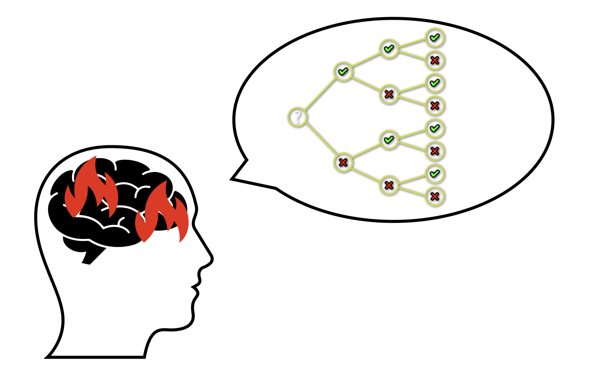
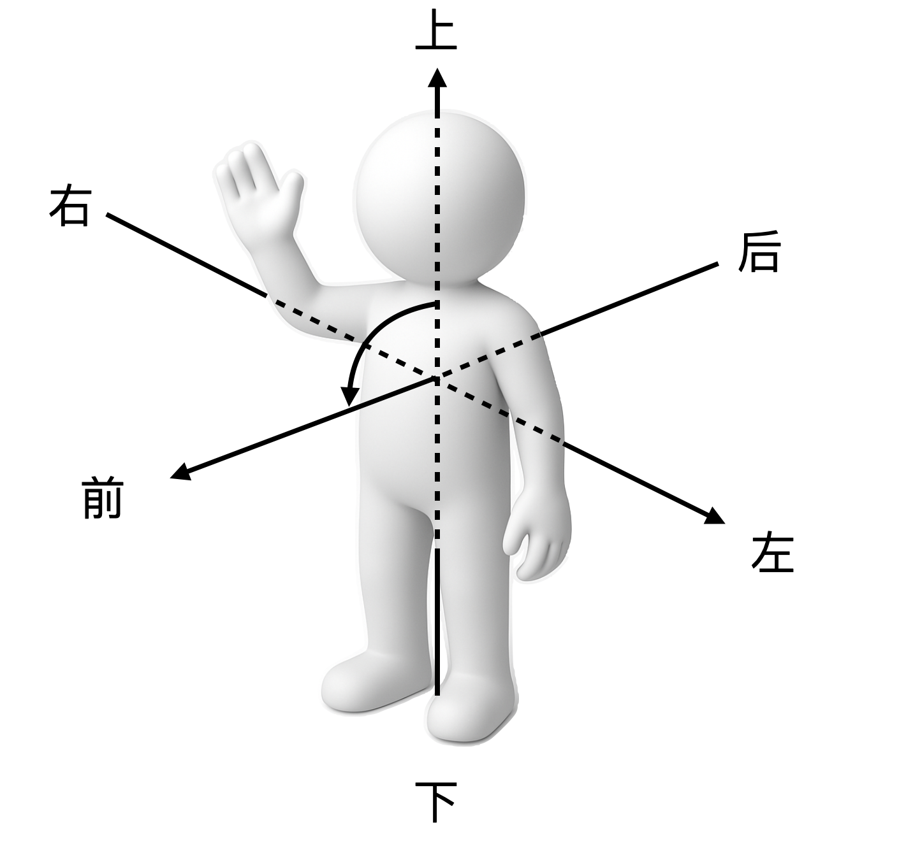
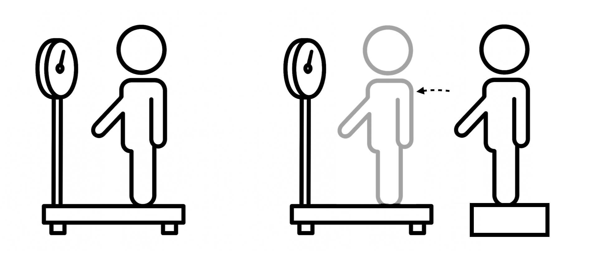

---
date:
  created: 2025-03-28
categories:
    - Philosophy
    - Study
comments: true
---
# 我靠做题改变命运，现在想教女儿快乐学习

## “优等生”的反思

<!--

每年高考都有新闻说某某“高考钉子户”还差多少分考上心仪的学校，来年准备再战——其中最著名的莫过于那位连续复读十几年的《高十》主人公。从他十几年高考的分数看来，他已经撞到了一个隐形天花板。新闻里面有一则评论很有意思：“真有实力进他目标学校的人，复读几年都能干进命题组了。” -->

作为一个寒窗苦读十几年靠知识改变命运的“小镇做题家”，我由衷地感激我从教育中得到的一切，却也深刻体会过“以考为纲”被迫追逐分数的痛苦，更惋惜那些在重压之下崩溃的灵魂。而我的经历也告诉我，“填鸭教学”的对立面——“三点下课玩乐、不留作业”那样“快乐地不学”只不过从一个极端走向了另一个极端。

因此，自从有了女儿以后我经常思考一个问题：如何能把学习的功力传授给她，让她在这个竞争更加激烈、“内卷”更加严重的环境里学业压力更小一点，在尽可能保持竞争力的同时有一个快乐的童年，甚至变得比她爸爸还要厉害。

这是可能的，因为我大部分时候是个优等生，但是在本科的时候也有过非常挣扎、听不懂又学不会的“学渣时刻”，这并非由于我跟老师磁场不合导致神经错乱、智商骤降，而是因为我在学习过程中撞到了某种难以察觉和突破的屏障。

在毕业多年之后，我一时兴起重新拿起了课本，猛然发现当年那些晦涩抽象的理论现在竟然能够看懂了，而且是跟原来完全不一样的思考路径。在仔细回忆了当年挣扎的过程之后，我认为主要差别是认知方法较当年有了巨大的提升，而这跟我做多年软件工程师的经验密切相关，因为这个职业经常要做三件事：

1. 在一个陌生的领域把老板们画的大饼、产品经理们天马行空的需求转变成如数学般严谨的程序代码，而这个过程中需要**准确理解大量模糊的新概念**，并且将其**精确地重新描述并且加以推理与应用**，这正是学习中“融会贯通”的一种体现。
2. 在结果不符合预期的时候，从**初始条件**出发，仔细探查**中间环节**，寻找造成**差异**的原因，并提出**改进**方法，这跟学习中不停修正认识如出一辙。
3. 制定合理的**执行计划**，降低**关键环节**遭遇困难造成阻碍而导致项目延期乃至失败的风险——这种风险在学习过程中同样存在，“从入门到放弃”最后一无所获的经历想必很多人都有过。

因此，学习本身可以被看作一个认知工程，可以使用对应的工程管理技巧和认知方法。工程管理本身并不困难，毕竟工地上的包工头也不尽是本科学历。而认知方法本身既不依赖天分，也不需要任何专业知识，只不过它本身是一个非常抽象的技能，受限于认知偏差、时间精力和语言能力等多种因素，在哲学素养和逻辑训练缺乏的应试教育环境下缺乏有效的引导，因而大部分人难以得到提升。

## 学习为什么困难？

小时候我爸大概以为我是个傻子：有一次我追着他问“到底为什么1+2=3？”，他解释了半天我也没听明白，于是他很生气地问我“这么简单到底哪里不明白？！”我当时很委屈，但是即使是现在，这个问题一般人也很难解释清楚。这就是所谓的“知识的诅咒”：人一旦掌握了某种知识，就很难设身处地地想那些不理解的人是如何思考的。

但是我记得我的困惑是什么。

现在做一个实验：

> 把0123456789依次替换成ABCDEFGHIJ，那么“DA+GE=?”

一个简单的两位数加法，在做了一个简单的变换之后就变得很困难，根本原因在于引入一个不熟悉的数字表示极大增加了**认知复杂度**——这是一个软件工程领域常用的名词，代表人认识一个系统的困难程度。而复杂度的增加正是来源于多了的两个转换步骤导致我们脑海中需要储存的新信息（转换结果）成倍增加。

如果给纸和笔，甚至只要多一点点时间，我相信所有人都能给出正确答案：DA+GE=30+64=94=JE——因为在短时记忆能力有限的情况下，我们会很自然地把它们拆分成若干个简单的问题（字母到数字转换、数字加法、数字到字母的转换），并利用额外的时间或者纸笔来辅助记忆中间结果。

切换到三十年前我的视角：一位数加法的规则就有100种，1+2=3就是其中之一，这还不包括进位的规则——前面的思想实验让成年人都觉得困难，何况对于一个认知还像白纸一样的三岁小孩呢。除了加法本身，还有十进制阿拉伯数字的表示、交换律、结合律……当这一系列陌生的概念一起砸过来的时候，先全部记下来再去尝试理解，一定是痛苦的——背过中英文单词对照表的同学一定深有感触，不信可以让考过留学英语考试的同学说出他们背过任何单词表的前几个单词，答案基本上只有一个：Abandon（放弃），因为它是几乎所有单词表的第一个单词。

## 怎么学习才不那么困难？

学习有没有捷径？当然有，因为捷径是一个相对的概念，只要相对于大部分人的效率更高就算。我认为很多人学得苦、学得累、学到最后还不会的原因正是效率低下，这主要体现在三个方面：

1. 认知顺序不合理
2. 概念理解不精确
3. 思维链路不流畅

因此，如何解决这三个问题就成了关键。

### 方法一：优化认知过程
学习的本质是一个把信息转录到大脑的过程，而人脑的特性就是：跟现有记忆无关联的不熟悉的东西处理得慢，而枯燥乏味的记忆过程也会让人产生抗拒心理，进而更加延缓这个步骤。

要让小孩学会加法，大概可以拿着鸡毛掸子盯着让他死记硬背几天加法规则就行了——孩子会长大，记忆能力会增强，加法规则会变得像呼吸一样平常，甚至九九乘法表也不在话下。可同时学习的难度也在加大，大部分人终究会遇到让他们难以理解的“1+2=3”——中学长久以来流传着一种说法：“很多同学到了高中理科下滑得厉害，是因为死记硬背那一套到了高中不管用了。”这种说法给很多同学留下了深刻的阴影，遇到瓶颈就开始怀疑自己，以致不少人“逃”到了文科班，殊不知那里很可能遇到一样的困境。

加法规则怎么来的，为什么要记忆这么多规则？这些问题是我的困惑所在，很显然我当时没有能力提出这些问题——而这却又恰是解决问题的关键：即便简单如加法，其概念之间是有关联和层次的，循着层次递进，逐步理解和记忆相比于一股脑背下来再去理解便是捷径。

以后我大概会则会么跟我女儿解释：

- 加法就是数数，加几就是往后数几个数，你已经知道从1数到10啦，1往后数2个数就是3，所以1+2=3
- 2往后再数1个也是3，所以2+1=3
- 阿拉伯数字1，2，3只是我们给那些数起的名字，其实以前人们画竖线来表示，有几个就画几竖，所以`I`,`II`,`III`是他们的另一种名字。
- 但是随着数字越来越大，人们就嫌太麻烦，就开始想办法简化。比如罗马人用V表示5，在他们前面加几个`I`就表示往前数几个，往后数几个就加几个`I`，所以`IV`是4的另一个名字，`VIII`是8的另一个名字。
- 再后来，人们觉得笔画还是太多了，就统一使用了今天的阿拉伯数字1，2，3……它比用罗马数字数数快多了，不信你照着这个加法表试试？

就这样，认知对象“加法”被拆解为了几个记忆量更小、可以从前往后推导从而自然衔接的层次：
1. 加法的本质是数数
2. 加法的交换律
3. 选择阿拉伯数字作为表示系统是因为它方便
4. 十进制数字的表示方式
……

更进一步，乘法也可以如法炮制——当手指数不过来的时候，九九乘法表便是一个只靠记忆就可以让数数变得更快更简单的“秘籍”。

回过头来看，虽然需要认识的内容总量增加了（多了罗马数字的表示），但是比起“背下来就自然理解了”的粗暴的方法，这条学习路径的理解和记忆起来更轻松，而且有趣得多——所以很多讲课很好的老师都喜欢谈论课本上没有的八卦，因为这些内容往往能够辅助理解记忆，还可以给暴露在密集知识点之下的同学们一点喘息的时间。可惜当年竟然有不识货的同学竟然投诉老师“讲太多跟高考无关的内容”。

不过这似乎陷入了一个怪圈——在“学会”之前，对于充满未知的所学之物，如何解构它的层次从而找到最优的递进策略？方法很简单：课程导论就是干的这个事情，只可惜导论课程长时间以来不受重视，很多老师讲不清楚，学生更是听得迷糊。但是各个领域都有非常优秀的人所作的教程和讲义，尤其是美式教材相较于与国内普遍的苏式风格的教程讲解清晰明了得多，在很多情况下借助他们辅助理解甚至自学的效率远高于课上一知半解、课后抓耳挠腮的方式。更何况，在中国买书可以说是白菜价了，而现如今国内已经大量引进外国科普读物和教程。

### 方法二：准确表述概念

“学会了”指的是能够理解规律并在思维过程中准确应用，而语言是思维的载体，清晰思考的体现就是能够清楚地表达。现代研究普遍认可“语言相对论”，即语言结构影响其使用者的世界观或认知，因此人类的感知与思考模式与其所使用的语言相关（著名科幻电影《降临》就是以它的强化版本“语言决定论”作为故事核心展开）。

学习和思考的过程是通过记忆已知，推理未知，从而直达结论的过程。而歧义代表着某种不确定性，因此如果思想和语言本身是模糊的，那么最终的不确定性就会随着推理深度指数叠加。因而学习得深入，脑子越迷糊。

虽然语言的使用对于大部分人来说已经跟呼吸一样自然，但是大部分情况下人们并不仔细思考自己说的话到底是什么意思，大概凑合差不多能理解就行了——因而时常遇到遇到类似“一个人成为单身狗的原因是谁都看不上”（到底谁看不上谁？）这样语言结构不明确导致的歧义，与“这个那个”等代词滥用造成的指代不清。

学习的阻力相当一部分来自于语言的模糊性，比如：

> “为什么镜子里面的像是左右颠倒，而不是上下颠倒？”

这看似只是一个物理成像的问题，实则是一个语言游戏。它可以说明我们日常语言有多么的不严谨，又如何进一步影响我们的思考和认知。

首先，颠倒本身指的就是上下移位，跟左右没什么关系。可改成“左右相反”还是不对，因为镜子里的人像左手依然在左边，右手也依然在右边，这怎么能叫“左右相反”呢？

而镜子里面的人像跟外面的人确实有一种相反的关系，但是应该怎么描述呢？这就需要想清楚“上下左右”到底指的是什么。实际上，“上下左右”是一种以观察者，也就是人自身为中心的方向定义：头在上、脚在下，胸在前、背在后，而左右是通过“上下前后”定义出来的。当方向的概念明晰了之后，显然镜子里的像并不是左右相反，而是“前后相反”。

当然，还有另一种理解——如果把观察者换成镜子里那个虚拟的人像，那么与镜子外的原来观察者真身相比，本体的左手确实变成了虚拟人像的右手，从这个意义上说，它的确是“左右相反”——但造成这种相反的原因是思维过程中的视角或者说观察主体的切换，而更本质的本体与成像“前后相反”的差异却在切换后被隐藏了。

由此可见，如果没有对语言本身含义的精确把握，一个非常简单的日常现象都会变得很难理解，因而学习思考更庞杂的知识体系时必然举步维艰。

只可惜，语言的语义属于哲学的研究范畴，而哲学一向被认为是文科而长期排除在理科教学之外，同时文科课程中的哲学在中学的课程安排由于客观原因而有意无意地略过了西方哲学史中几大哲学家的核心思想。好在语言和思维的训练完全可以通过自主学习哲学开始，《大问题：简明哲学导论》和《苏菲的世界》便是最好的启蒙读物。

### 方法三：梳理思维链路

学习的过程中我们会对理解的概念进行连接和推导，从而构建出一个“信念之网”。当遇到问题，我们就会从这个信念之网的某个节点出发试图找到一个通向某个结论的链路——这个就是随着大语言模型而火起来的“思维链”。

而很多时候，“不理解”实质上是“思维链路”不通顺，这一般有两个原因：关键知识的缺失、认知方式的偏差。将脑中模糊的思维链**写到纸上**，往往能够很容易发现其中缺失和断裂的环节，我们可以从而查漏补缺或修正认知。其中，把思维链写下来有几个好处：

1. 书写迫使我们思考从而准确地表述相关概念
2. 思维链拆解成多个环节之后可以被分开审辨，从而降低这个过程中的认知复杂度
3. 用书面语言表达的思维链方便用于交流和提问

关键知识缺失造成的认知困难很好理解。当年我初三月考的时候有这么一道化学题：

> 黄瓜富含维生素，那么以下哪种方式处理方式最营养？
>
> A. 切片跟猪肉爆炒
> B. 拍碎用陈醋凉拌
> C. 切块加排骨炖汤
> D. 去皮与牛肉黄闷

一个同学死活想不明白，反问“为什么不切着吃”在课堂上跟老师纠缠了很久。我当时还因为觉得这是胡搅蛮缠而生气，因为这没什么好纠结的：

1. 黄瓜富含维生素
2. 维生素C是维生素的一种
3. 维生素C容易被高温破坏
4. 除了B选项，所有烹饪都有加热步骤

所以，陈醋凉拌保留最多维生素C，肯定最营养啊！

出题人意图的思维链路应该就是这样，虽然说他这个题的“脑回路”有点绕，但在初三化学有限的知识体系内这个推理路径还是基本合理的。而那个同学想不明白的原因大概率是缺失了“维生素C容易被高温破坏”这一环，从而无法推导下去得到答案——回去看课本就很容易补齐。

回想起来，我遇到最痛苦的学习经历之一是大学物理——麦克斯韦方程学不会的一个主要原因是讲课的时候数学课的多重积分还没学到。

还有一类属于认知偏差。我初三的时候还碰到过一个物理题：

> 一个人最初静止地站在电子秤上。随后，他开始做一个下蹲再站起的动作。下列关于秤上读数变化的说法中，正确的是哪一项？
>
> A. 在整个过程中，秤的读数始终不变。
> B. 在下蹲的过程中，读数减小；在站起的过程中，读数增大。
> C. 在下蹲的过程中，读数增大；在站起的过程中，读数减小。
> D. 秤的读数只取决于人的质量，动作不会对其产生影响。

正确选项是B，因为下蹲过程中重心下移意味着重力大于秤的支持力，反之则意味着重力小于支持力。

而我选了C。当时我的想法是这个过程可以等价于：一个人从和秤一样高的台阶上轻轻平跳到秤上立即下蹲，因而这个人和下蹲一样也有一个从0开始慢慢增加的速度，而这个过程速度秤的示数显然是一直增大的，综合所有选项只有C满足条件。

这个思维过程犯的错误比较隐蔽，老师没听懂我在说什么，而聪明的同桌听懂了却没能发现问题，所以我苦思冥想了一整个晚自习的时间导致作业差点没写完。如果我来给当年的自己讲这道题，只要把思维链的各个环节清晰地列举出来逐个审视、质疑，存在的问题就会很明显：

- 为什么能得到下蹲读数增大的结论？
   - 因为我提出的等价模型能够得到这个结论。
- 为什么等价模型能够得到这个结论？
  - 因为跳上去的时候秤的示数是0，人站在上面示数肯定大于0，所以肯定下蹲的过程是增加。
- 为什么这两个模型等价？
  - 因为刚跳到秤上的那一瞬间，人的速度为0，同时有一个下蹲的重力加速度，和静止正要下蹲的人的状态完全一致。
  
而问题就出现在这两个物理模型等价的假设上：二者不等价，因为我提出的模型只考虑了人的状态而忽略了秤。原题中秤的初始示数是体重，而我的模型中最开始示数是0，因此如果要和原题状态一致需要等到秤的示数和体重一致再开始下蹲，这时候答案就是B了。如果当时我能把这个思维过程列出来问老师，可能5分钟就能搞明白。

这个审视因果的方法叫做“五问法”(5 Whys)，因为大多数情况下最多5问就能够直达问题的核心。它来源于丰田汽车制造方法学中积累的宝贵经验，现在已经被广泛应用到包括软件开发在内的诸多领域。

其实这个方法跟我们俗语中的“打破沙锅问到底”异曲同工，但是怎么有效地提问、怎么深入问题的本质是需要大量的练习和思考才能够熟练掌握的。

## 总结

总而言之，学习是有捷径的，但是决不是那种能让一个中专生自学两年偏微分方程和“谢惠民的数学方面”之后参加竞赛就能碾压全世界的那种捷径——从理论上这就是不可能的：对于无数个认知复杂度远高于“九九乘法表”的理论，那种期望就如同指望熟读《唐诗三百首》便可作莎士比亚戏剧，或者学会自由泳之后便可徒手登珠峰一样荒谬可笑。

对真理之山应该心存敬畏之心，但是攀登的时候，不妨借助前人留下的绳索；在登顶之后，也别忘了给后人铺一块砖。

## 花絮
（以下对话纯属虚构）

- 媳妇：“所以，这就是你们985理工男爱说教的原因？”
- 我：“果然你们女人得到了就不懂得珍惜！以前要我讲题的时候恨不得叫我‘神’，现在得到了、嫌烦了、薅光头了、榨出油了，就叫人家‘总想教会你什么东西的既普通又自信的中年油腻男’？网上说的都是对的，不管女人多少岁，喜欢的永远是十八岁！你嫌我人老珠黄了是吧！”
- 媳妇：“嘿，‘男人至死是少年’是吧？我可从来不爱听说教！这么多话讲给你穿尿布的小情人听去，她现在爱读书听故事！”